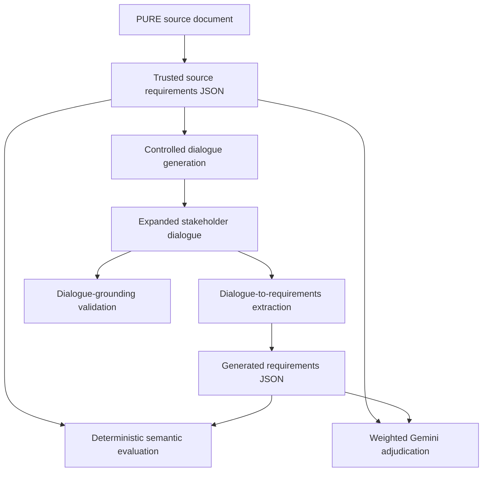
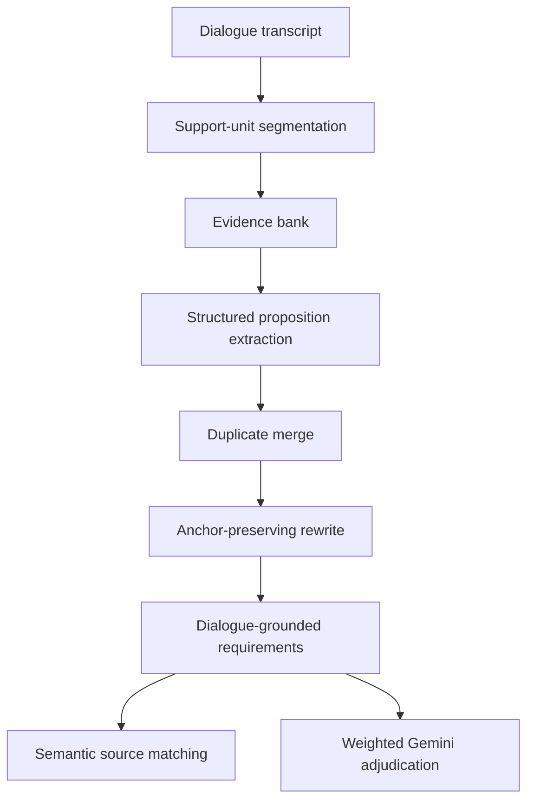

# A Pilot Stage-Wise Benchmark for Source-Faithful Dialogue-to-Requirements Recovery over PURE Documents

## Abstract

We study requirement recovery as a source-grounded benchmark problem rather than a free-form text-generation task. Starting from trusted PURE requirements, we generate controlled stakeholder dialogues and evaluate whether large language models can reconstruct the original requirements from dialogue alone. The pipeline combines a semantic-gap dialogue controller, a proposition-oriented dialogue-to-requirements extractor, dialogue-grounding validation, deterministic semantic source matching, and a secondary weighted checklist-based Gemini adjudication layer. On a verified 2-document local slice, the conversational local pipeline outperforms the direct local baseline with `F1 = 0.8844` versus `0.7714`. On a broader 4-document cross-model slice, Gemini is stronger on dialogue-mediated recovery, reaching conversational `P/R/F1 = 0.7157/0.6912/0.7032`, while Ollama is stronger on the direct source-to-requirements baseline with `F1 = 0.9203` versus Gemini's `0.7784`. These results show that direct structured generation and dialogue-mediated source recovery are distinct evaluation conditions. The main remaining bottleneck is not unsupported hallucination, but loss of exact source-faithfulness under paraphrastic recovery.

## 1. Introduction

Large language models can generate plausible requirement text, but plausible text is not the scientific target of this project. The central question is whether a controlled elicitation dialogue preserves enough information to recover trusted source requirements faithfully and measurably.

This paper therefore frames the problem as `requirements -> dialogue -> requirements` recovery on source-grounded PURE benchmark documents. We begin with trusted source requirements, generate controlled dialogues from them, and then ask a model to reconstruct the requirements from dialogue alone. Recovery is scored against the original trusted source, not against human preference for fluency.

This framing matters for two reasons. First, it separates source recovery from generic requirement writing quality. Second, it lets us analyze where information is lost: during dialogue generation, during evidence extraction, during proposition synthesis, or during final matching.

The paper makes four contributions:

1. A pilot source-grounded benchmark workflow for dialogue-mediated requirement recovery.
2. A provider-independent controlled dialogue generator based on semantic uncoveredness rather than unconstrained chat turns.
3. A dual-layer evaluation design combining deterministic semantic matching with weighted checklist-based LLM adjudication.
4. A cross-model comparison showing that direct-source performance and dialogue-mediated recovery performance can diverge substantially.

## 2. Related Work

The first relevant line of work is requirements extraction and normalization. Earlier requirements-engineering research emphasized rule-aware extraction and structured requirement syntax, including GUEST-style goal/use-case extraction [R6], EARS-style controlled requirement phrasing [R7], and FRET-style formalization-aware requirements tooling [R8]. Our work does not attempt full formalization, but it adopts the same design principle: source-preserving structure matters.

The second relevant line of work concerns retrieval granularity and post-generation correction. Proposition-sized retrieval units can outperform coarser passage retrieval in information recovery settings [R1], contextual chunking can preserve local detail better than naive chunking [R2], and retrieval-augmented correction can improve factual post-processing [R3]. These ideas motivate our evidence-bank and proposition-first design.

The third relevant line of work concerns evaluation methodology. Checklist-based LLM judging can improve consistency relative to unconstrained free-form judging [R4], but recent work also shows that judge models remain brittle and should not replace primary evaluation metrics entirely [R5]. More broadly, benchmark comparisons themselves can be sensitive to benchmark composition and weighting assumptions [R13], which argues for reporting per-document results instead of relying only on a single aggregate score.

## 3. Research Questions

We organize the empirical study around three research questions.

**RQ1.** Can a controlled conversational pipeline outperform a direct local baseline on a verified compact PURE slice?

**RQ2.** What failure mode remains on the hardest PURE document after the main infrastructure and recall fixes?

**RQ3.** On a broader 4-document slice, how do a frontier Gemini model and a local Ollama model compare on direct source-to-requirements generation versus dialogue-mediated source recovery?

## 4. Methodology

### 4.1 Benchmark Construction

The benchmark begins with trusted source requirements derived from public PURE documents and stored as structured JSON. These source files are the gold standard for all downstream evaluation.

The workflow has four stages:

1. Build trusted source-grounded requirement JSON from PURE documents.
2. Generate a controlled elicitation dialogue from those requirements.
3. Extract requirements from the dialogue with a structured LLM pipeline.
4. Score the recovered requirements against the original source using both deterministic and weighted secondary evaluation layers.

### 4.2 Controlled Dialogue Generation

The dialogue generator is a controller, not a free-form chatbot loop. The current `semantic_gap_llm_v2` algorithm:

1. Assigns each source requirement to one or two semantic themes.
2. Recomputes sentence/clause-level coverage after each user answer.
3. Ranks uncovered themes by priority, uncovered count, and residual semantic gap.
4. Forces clarification rounds when critical themes remain below configured recall floors.
5. Generates exactly one follow-up interviewer question and one consolidated stakeholder answer at each step.
6. Preserves short exact technical phrases when those phrases are critical to downstream recovery.

The controller is shared across Gemini and Ollama runs. Provider choice affects generation quality and latency, but not the theme-selection or stopping logic.

### 4.3 Dialogue-to-Requirements Extraction

The extraction pipeline is proposition-first rather than direct final-schema generation.

The implemented flow is:

1. Split user turns into sentence/clause support units.
2. Build an evidence bank over those units.
3. Feed either full-context dialogue or evidence-focused batches to the extraction model.
4. Extract atomic propositions in structured JSON.
5. Merge duplicate propositions conservatively.
6. Rewrite grounded-but-generic propositions when they lose anchors such as roles, negation, numbers, or interface/storage phrases.
7. Convert the resulting proposition set into the final requirement schema.
8. Validate every final requirement against the dialogue before source scoring.

### 4.4 Evaluation Protocol

The primary evaluation layer is deterministic semantic matching:

- one-to-one greedy source/generated matching
- sentence-transformer embeddings
- acceptance threshold `0.55`
- primary metrics: precision, recall, F1, hallucination rate

The secondary evaluation layer is weighted Gemini adjudication:

- shortlist top semantic and lexical candidates
- judge each source/generated pair as `full`, `partial`, or `none`
- convert those judgments into weighted scores with `full = 1.0`, `partial = 0.5`, and `none = 0.0`

We intentionally use the weighted judge as a secondary faithfulness diagnostic rather than a replacement for the deterministic benchmark. This follows the current LLM-judge literature: structured judging is useful [R4], but judge outputs remain too brittle to serve as sole ground truth [R5].

### 4.5 Reporting and Reproducibility Method

The manuscript structure and reporting choices were revised using empirical software-engineering and NLP reproducibility guidance.

From empirical software-engineering reporting guidance [R9][R10], we adopt the following principles:

1. State the research question and study condition explicitly.
2. Keep problem, method, results, and threats to validity in clearly separated sections.
3. Report enough design detail that a replication package can be understood and rerun.
4. Avoid mixing methodological claims, implementation notes, and headline results in the same section.

From ICSE open-science guidance [R11], we adopt the principle that artifacts should be shared by default and that the paper should explain how they can be accessed.

From the NLP reproducibility-checklist literature [R12], we treat reporting of metrics, infrastructure, evaluation procedures, and artifact availability as part of the scientific method rather than as optional appendix material.

From recent benchmark-robustness work [R13], we avoid relying only on a single aggregate score. We therefore report both aggregate and per-document results, and we explicitly separate compact verified slices from broader cross-model slices.

## 5. Experimental Design

### 5.1 Benchmark Slices

Table 1 summarizes the slices used in this paper.

| Slice | Documents | Purpose | Main comparison |
| --- | --- | --- | --- |
| Local-2Doc | `gamma_j`, `dii` | Compact verified slice | local direct vs local conversational |
| Hard-1Doc | `cctns` | Stress-test dialogue and extraction fidelity | local vs frontier diagnostics |
| CrossModel-4Doc | `cctns`, `gamma_j`, `dii`, `microcare` | Paper-facing multi-document comparison | Gemini vs Ollama |

### 5.2 Models

For the paper-facing 4-document slice:

- **Gemini** refers to `gemini-2.5-pro` for generation and `gemini-2.5-flash` for weighted adjudication.
- **Ollama** refers to local `qwen2.5:7b-instruct`, with the same fixed `gemini-2.5-flash` secondary validator.

Important comparability note:

The final 4-document paper comparison uses matched `full_context` conversational artifacts for both models. The evidence-bank workers did not complete reliably inside the same run window, so the 4-document comparison should be described as a matched full-context comparison, not as an evidence-bank-vs-evidence-bank comparison.

### 5.3 Obsidian-Friendly Table Policy

To keep the manuscript readable in Obsidian, the paper uses only narrow, paper-style tables in the main body. Wider diagnostic tables remain in the companion comparison report rather than in the manuscript itself.

## 6. Results

### 6.1 RQ1: Verified 2-Document Local Slice

Table 2 reports the compact verified local result.

| System | Precision | Recall | F1 |
| --- | ---: | ---: | ---: |
| Direct local baseline | 0.8852 | 0.6835 | 0.7714 |
| Conversational local pipeline | 0.9559 | 0.8228 | 0.8844 |

On this verified 2-document slice, the conversational local pipeline clearly outperforms the direct local baseline. This remains the strongest compact result in the project.

### 6.2 RQ2: Hard Single-Document Stress Test

Table 3 reports the strongest hard-document conditions used in the current paper narrative.

| System | Dialogue R | Conv. P | Conv. R | Conv. F1 | Judge Rw |
| --- | ---: | ---: | ---: | ---: | ---: |
| Ollama hard rerun | 0.8500 | 0.7857 | 0.5500 | 0.6471 | N/A |
| Gemini hard rerun | 0.9400 | 0.8272 | 0.6700 | 0.7403 | 0.5200 |

The hard-document result establishes two points. First, the earlier failure was not simply that local infrastructure could not complete. Second, once the infrastructure and recall fixes are applied, the main remaining problem is source-faithfulness rather than unsupported generation. The Gemini hard rerun crosses the target semantic recall threshold on this document, but the weighted secondary score shows that many recoveries remain partial.

### 6.3 RQ3: Four-Document Cross-Model Slice

Table 4 gives the main aggregate comparison for the paper-facing 4-document slice.

| Model | Dial. R | Direct F1 | Conv. P | Conv. R | Conv. F1 | Judge Rw | Judge F1w |
| --- | ---: | ---: | ---: | ---: | ---: | ---: | ---: |
| Gemini | 0.9118 | 0.7784 | 0.7157 | 0.6912 | 0.7032 | 0.5294 | 0.5387 |
| Ollama | 0.8824 | 0.9203 | 0.4967 | 0.3725 | 0.4258 | 0.3211 | 0.3669 |

Table 5 shows the per-document recall pattern, which is the most important paper-facing breakdown because the scientific question is requirement recovery.

| Document | Dial. R G | Dial. R O | Conv. R G | Conv. R O | Judge Rw G | Judge Rw O |
| --- | ---: | ---: | ---: | ---: | ---: | ---: |
| `pure_0000_cctns` | 0.9400 | 0.9000 | 0.7200 | 0.4100 | 0.5700 | 0.3500 |
| `pure_0000_gamma_j` | 0.8596 | 0.8246 | 0.6140 | 0.3684 | 0.5351 | 0.3333 |
| `pure_1999_dii` | 0.8636 | 0.8636 | 0.5909 | 0.0909 | 0.3409 | 0.2045 |
| `pure_2005_microcare` | 0.9600 | 0.9600 | 0.8400 | 0.4800 | 0.5200 | 0.2800 |

Three findings follow directly from Tables 4 and 5.

1. Gemini is stronger on dialogue-mediated recovery on all four documents.
2. Ollama is stronger on the direct source-to-requirements baseline on the same slice.
3. The cross-model difference is not driven by unsupported hallucination, because both conversational runs remained fully grounded after dialogue validation.

### 6.4 Dialogue Grounding

Both conversational 4-document runs remained fully grounded after dialogue validation:

- Gemini: `197/197` grounded, `0` hallucinated
- Ollama: `153/153` grounded, `0` hallucinated

This matters because it shows that the main cross-model gap is not a hallucination gap. It is a source-faithfulness gap.

### 6.5 Local Recovery-Stage Reproducibility and Anchor Ablation

To reduce dependence on a single local extraction run, the Qwen2.5-7B dialogue-to-requirements recovery stage was repeated on the same four-document source/dialogue slice. These runs reuse fixed source and dialogue artifacts from the original four-document Ollama run, so this check evaluates recovery-stage reproducibility rather than full end-to-end dialogue-generation variance.

| Condition | Docs | Runs | Dialogue Recall | Semantic Precision | Semantic Recall | Semantic F1 | Note |
| --- | ---: | ---: | ---: | ---: | ---: | ---: | --- |
| Qwen full pipeline | 4 | 3 | 0.8824 ± 0.0000 | 0.4857 ± 0.0000 | 0.4167 ± 0.0000 | 0.4485 ± 0.0000 | Fixed source/dialogue recovery-stage check |
| No anchor preservation | 4 | 1 | 0.8824 | 0.4857 | 0.4167 | 0.4485 | Anchor-preservation ablation |

The repeated runs produce identical aggregate metrics, which supports reproducibility under a fixed configuration rather than stochastic variance estimation. The no-anchor-preservation ablation shows no measurable change for the 7B local model on this slice, suggesting that anchor-preservation instructions may matter more for larger frontier models or longer documents. These repeated runs are therefore reported as a reproducibility check rather than as statistical confidence intervals.

A 50-example error sample was initialized using heuristic labels and then manually reviewed. After review, 28 of 50 draft labels were corrected. The final human-reviewed distribution (Table 6) shows that scope generalization and unsupported additions together account for 36% of all errors, and genuine full matches are more frequent than the heuristic labels initially suggested.

| Error type | Count | Percent |
| --- | ---: | ---: |
| FULL_MATCH | 14 | 28.0% |
| NO_MATCH | 12 | 24.0% |
| PARTIAL_SCOPE_GENERALIZED | 10 | 20.0% |
| UNSUPPORTED_ADDITION | 8 | 16.0% |
| PARTIAL_CONDITION_DROPPED | 3 | 6.0% |
| DUPLICATE_OR_MERGED | 2 | 4.0% |
| PARTIAL_NUMERIC_ANCHOR_DROPPED | 1 | 2.0% |

The dominant failure modes after manual review are scope generalization (20%) and unsupported additions (16%), not actor dropping as the heuristic labels initially over-predicted. This supports the main paper claim that the recovery bottleneck is paraphrastic scope drift rather than outright hallucination.

## 7. Discussion

The pilot results suggest a consistent asymmetry between direct structured generation and dialogue-mediated recovery.

Ollama remains highly competitive, and on the 4-document slice it is stronger than Gemini on the direct source-to-requirements condition. However, once the task becomes mediated by elicitation dialogue, Gemini becomes clearly stronger. This means that model quality alone does not explain the full behavior of the pipeline. The more demanding scientific problem is preserving source-faithful information across multiple transformations:

`source requirements -> elicitation dialogue -> support units -> propositions -> recovered requirements`

The weighted secondary judge strengthens that conclusion. Gemini remains better than Ollama under weighted adjudication, so the advantage is not only an embedding-threshold artifact. At the same time, weighted scores remain below semantic scores for both models, which shows that partial recovery remains a major unresolved issue.

## 8. Threats to Validity

### 8.1 Conclusion Validity

The paper reports deterministic semantic metrics and weighted secondary metrics, but it does not yet include confidence intervals or repeated-run variance estimates for all slices. The current evidence is therefore strongest as a benchmark comparison, not as a full stability analysis.

The repeated Qwen runs reuse fixed source and dialogue artifacts and therefore test recovery-stage reproducibility, not full end-to-end variance across dialogue generation. In the current pushed artifacts, repeated local runs produce identical aggregate scores under the same configuration. These repeated runs are therefore reported as a reproducibility check rather than as statistical confidence intervals.

### 8.2 Construct Validity

Semantic recall and weighted LLM recall do not measure exactly the same construct. The deterministic metric measures benchmark-aligned semantic recovery, whereas the weighted judge measures a stricter notion of source-faithfulness. Reporting both helps, but neither should be confused with human legal or contractual validation.

The error-analysis sample was initialized with heuristic labels and subsequently manually reviewed. Heuristic labels are useful for rapid triage, but final claims about error category distributions rely on the human-reviewed labels reported in Section 6.5.

### 8.3 Internal Validity

The 4-document comparison uses matched full-context conversational artifacts rather than matched evidence-bank artifacts, because the long evidence-bank workers did not complete reliably in the same run window. Some run packaging also required manual salvage of completed artifacts after those worker stalls.

The anchor-preservation ablation is a single diagnostic ablation over the four-document slice. It is useful for identifying whether anchor instructions influence recovery, but it should not be interpreted as a complete ablation study of all pipeline components.

### 8.4 External Validity

The study uses PURE documents rather than industrial proprietary corpora. The strongest verified local result still covers 2 documents, and the broader cross-model result covers 4 documents rather than the full 6-document benchmark. Generalization beyond source-grounded benchmark conditions should therefore be made cautiously.

## 9. Reproducibility and Artifact Availability

Following current open-science guidance [R11][R12], the paper should treat artifact availability as part of the method, not as an afterthought.

Primary artifacts for the current draft are:

- [workflow and result draft](./project_workflow_and_results.md)
- [Gemini 4-document run summary](../outputs/pure_full_runs/20260429T001722Z_pure_full/comparison_summary.json)
- [Ollama 4-document run summary](../outputs/pure_full_runs/20260429T002305Z_pure_full/comparison_summary.json)
- [cross-model report PDF](../outputs/paper_reports/20260429_4doc_gemini_vs_ollama/cross_model_comparison_report.pdf)
- [cross-model report Markdown](../outputs/paper_reports/20260429_4doc_gemini_vs_ollama/cross_model_comparison_report.md)

For a submission-ready package, the artifact bundle should include:

1. the exact run configuration for every reported slice
2. the generated dialogues and recovered requirements
3. the semantic scoring scripts
4. the weighted adjudication prompts and outputs
5. a top-level reproduction guide with expected runtime and environment notes

## 10. Conclusion

This pilot study examines dialogue-mediated requirement recovery as a source-grounded benchmark problem. The pilot results suggest that a controlled conversational pipeline can outperform a direct local baseline on a verified compact slice, which shows that structured dialogue can be useful rather than purely lossy. However, the broader 4-document comparison reveals a more nuanced result: Ollama is stronger on direct source-to-requirements generation, while Gemini is substantially stronger on dialogue-mediated recovery. The remaining core challenge is not generic requirement generation and not unsupported hallucination. It is exact source-faithfulness after several lossy transformations. That is the central technical and methodological problem the next version of the pipeline must solve.

## References

[R1] Khattab, Omar, et al. *Dense X Retrieval: What Retrieval Granularity Should We Use?* EMNLP 2024. https://aclanthology.org/2024.emnlp-main.845.pdf

[R2] Günther, Michael, et al. *Late Chunking: Contextual Chunk Embeddings Using Long-Context Embedding Models.* arXiv 2024. https://arxiv.org/abs/2409.04701

[R3] Kim, Seungone, et al. *RAC: Efficient LLM Factuality Correction with Retrieval Augmentation.* arXiv 2024. https://arxiv.org/abs/2410.15667

[R4] Luo, et al. *CheckEval: A Reliable LLM-as-a-Judge Framework for Evaluating Text Generation Using Checklists.* EMNLP 2025. https://aclanthology.org/2025.emnlp-main.796.pdf

[R5] *LLM-as-a-Judge Failures at Automating the Identification of Poor Quality.* NEWSUM 2025. https://aclanthology.org/2025.newsum-main.1.pdf

[R6] Nguyen, et al. *Rule-Based Extraction of Goal-Use Case Models from Text.* ESEC/FSE 2015. https://nzjohng.github.io/publications/papers/fse2015.pdf

[R7] Mavin, et al. *Easy Approach to Requirements Syntax.* RE 2009. https://ccy05327.github.io/SDD/08-PDF/Easy%20Approach%20to%20Requirements%20Syntax%20%28EARS%29.pdf

[R8] Giannakopoulou, et al. *Capturing and Analyzing Requirements with FRET.* NASA Technical Seminar 2020. https://ntrs.nasa.gov/citations/20205001989

[R9] Kitchenham, Barbara, et al. *Evaluating Guidelines for Reporting Empirical Software Engineering Studies.* Empirical Software Engineering 13 (2008): 97-121. https://link.springer.com/article/10.1007/s10664-007-9053-5

[R10] Revoredo, Kate, Djordje Djurica, and Jan Mendling. *A Study into the Practice of Reporting Software Engineering Experiments.* Empirical Software Engineering 26 (2021): 113. https://link.springer.com/article/10.1007/s10664-021-10007-3

[R11] ICSE 2025 Research Track. *Open Science Policy.* https://conf.researchr.org/track/icse-2025/icse-2025-research-track?track=ICSE+Research+Track+ICSE+SE+In+Practice

[R12] Magnusson, Ian, Noah A. Smith, and Jesse Dodge. *Reproducibility in NLP: What Have We Learned from the Checklist?* Findings of ACL 2023. https://aclanthology.org/2023.findings-acl.809.pdf

[R13] Ailem, Melissa, et al. *Examining the Robustness of LLM Evaluation to the Distributional Assumptions of Benchmarks.* ACL 2024. https://aclanthology.org/2024.acl-long.560.pdf
